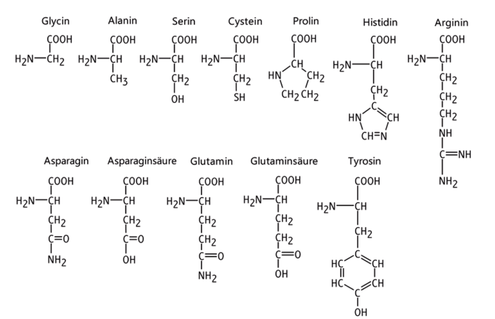

# Experimente


Es stehen Ihnen für die Experimente folgende Chemikalien zur Verfügung:

* 1 mol/L HCl(aq) :goggles:
* 1 mol/L NaOH (aq) :goggles:
* 3% $$H_2O_2$$ :goggles:
* dest. Wasser
* Milch


## Ananas

<figure><figcaption></figcaption></figure>

In Ananas ist ein Enzym enthalten. Führen Sie ein Experiment mit roher und gekochter/erhitzter Ananas durch.

## Papaia

<figure><figcaption></figcaption></figure>

In der Papaia ist ein Enzym enthalten. Führen Sie ein Experiment mit roher und gekochter Papaia durch.

## Hefe

<figure><figcaption></figcaption></figure>

## Kartoffel

<figure><figcaption></figcaption></figure>
