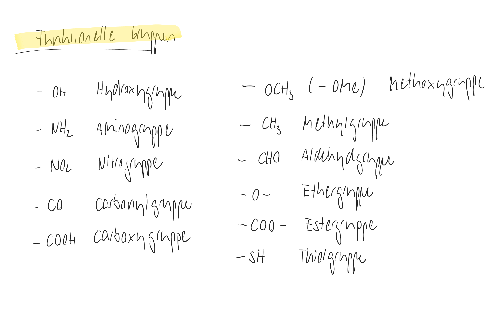

# Stoffübersicht Maturprüfung

## Hilfsmittel



## Dauer

2 Stunden

## Grundlagen

* [ ] Funktionelle Gruppen:

<figure><figcaption></figcaption></figure>

## Prüfungsstoff

Nachfolgend sind die Themenbereiche mit Verweisen zu den entsprechenden Modulen auf der Webseite aufgelistet. Bis zum Semesterende sind noch kleinere Anpassungen notwendig.

### Orbitalmodell

* [ ] Licht und Elektronen als Teilchen- und Wellenerscheinung
* [ ] Formen der Orbitale
* [ ] Hybridisierung
* [ ] Valenzbindungstheorie und MO-Theorie
* [ ] MO-Diagramme
* [ ] Bindungsordnung
* [ ] HOMO/LUMO

### Farbigkeit

* [ ] Konjugation und Mesomerie
  * [ ] Elektronendelokalisierung
  * [ ] Mesomerer Effekt
* [ ] Absorption
* [ ] Komplementärfarben
* [ ] Chromophore, Auxochrome/Antiauxochrome, Bathochrome
* [ ] Grundzustand, Anregungszustand

### Reaktionen

* [ ] Säure/Base-Reaktionen
  * [ ] Brønstedt- und Lewis-Säuren
  * [ ] [Stabilität von Säuren und Basen](../molekuelorbitale-und-organisch-chemische-reaktionen/stabilitaet-von-saeuren-und-basen/)
* [ ] Redoxreaktionen
  * [ ] [Oxidation von Alkoholen](https://de.serlo.org/chemie/128041/oxidation-von-alkoholen-durch-permanganatl%C3%B6sung)
* [ ] Nucleophile Substitutionen
* [ ] Elektrophile Addition
* [ ] Radikalische Substitution
* [ ] [Katalysierte Hydrierung](../synthesen/synthese-von-rheosmin-himbeerketon/katalysierte-hydrierung.md)

### [Thermodynamik](../thermodynamik/)

* [ ] Hauptsätze
* [ ] Enthalpie
  * [ ] Reaktionsenthalpie einer Reaktion berechnen können.
* [ ] Entropie
  * [ ] Reaktionsentropie einer Reaktion berechnen können.
* [ ] Gibbs-Helmholtz-Gleichung ( $$\Delta G=\Delta H-T \Delta S)$$
* [ ] Spontanität einer Reaktion
  * [ ] Die Gibbs-Energie ( $$\Delta G$$) berechnen und bestimmen, auf welcher Seite das generelle Gleichgewicht liegt.

### Nanotechnologie

* [ ] [Grössenordnungen](../nanotechnologie/groessenordnungen.md)
* [ ] AFM
* [ ] Nano-Gold
  * [ ] Anwendung von Nano-Gold
* [ ] Quantenpunkte

### [Komplexchemie](lernziele-maturpruefung.md#komplexchemie)

* [ ] Lewis-Säuren und -Basen
* [ ] Koordinationszahl
* [ ] 18-Elektronen-Regel
* [ ] Mehrzähnige Liganden
* [ ] Komplexe in lebendingen Systemen
* [ ] Nomenklatur von Komplexen
* [ ] Farbigkeit von Komplexen
* [ ] Kristallfeld- und Ligandenfeldtheorie
* [ ] Komplexe in der Medizin

### [Arzneimittel](lernziele-maturpruefung.md#arzneimittel)

* [ ] Synthese und Wirkungsweise eines Antibiotikums: Sulfamethoxazol
* [ ] Antiacida
  * [ ] Zusammensetzung klassischer Antiacida
  * [ ] Protonenpumpenhemmer
* [ ] Aspirin-Synthese und Wirkungsweise

### [Biochemie](lernziele-maturpruefung.md#biochemie)

* [ ] Aminosäuren
  * [ ] Struktur
  * [ ] Titration
  * [ ] Isoelektrischer Punkt
  * [ ] Fischer-Projektion
* [ ] Proteine
  * [ ] Sekundärstrukturen
  * [ ] Bildung von Tertiär- und Quartärstrukturen
* [ ] Enzyme
  * [ ] RGT-Regel
* [ ] Enzym-Kinetik (Michaelis Menten)

### Analytische Chemie

* [ ] Absorption und Emission
* [ ] Wellenlänge und Frequenz
* [ ] [Spektroskopie](../spektroskopie/)
  * [ ] IR&#x20;
    * [ ] Sie können bspw. Alkohole, Carbonsäuren und Aldehyde voneinander unterscheiden.
  * [ ] UV/Vis

### Synthesen

* [ ] Rheosmin-Synthese

