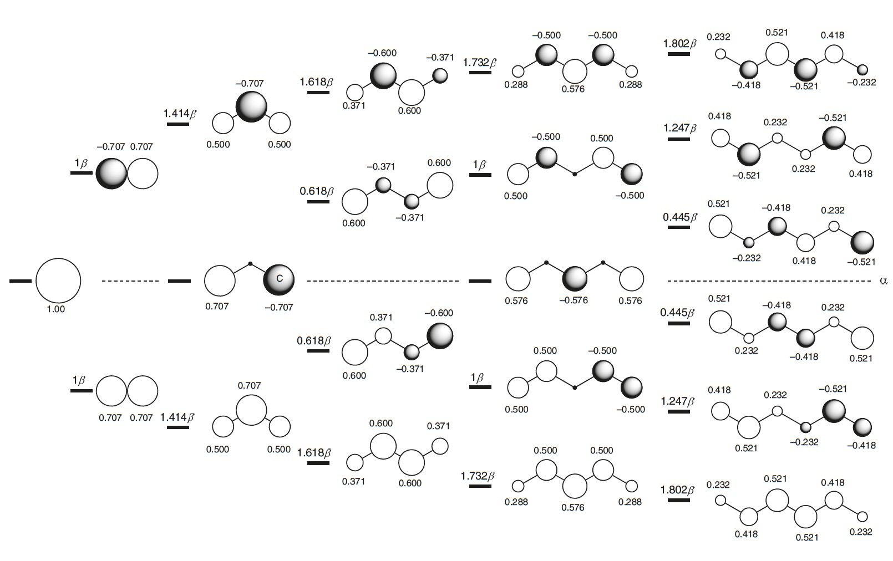

# Molekülorbitale und organisch-chemische Reaktionen

## Benzol

Eine der auffälligsten Eigenschaften konjugierter organischer Moleküle ist die besondere Stabilität, die in der Gruppe der aromatischen Moleküle zu finden ist, deren ältestes Beispiel Benzol ist. Hückel sagte voraus, dass Benzol keineswegs allein ist und dass zyklische konjugierte Polyene eine aussergewöhnlich niedrige Energie haben, wenn die Gesamtzahl der $$\pi$$ Elektronen als eine Zahl der Form (4n + 2) beschrieben werden kann, wobei n eine ganze Zahl ist.

<figure><figcaption></figcaption></figure>

## Konjugierte Systeme

Je ausgedehnter das konjugierte System, desto tiefer die Energie. Das folgende Diagramm veranschaulicht dies ausgehend von einem einzelnen p-Orbital links (Ansicht von oben):

<figure><figcaption></figcaption></figure>
