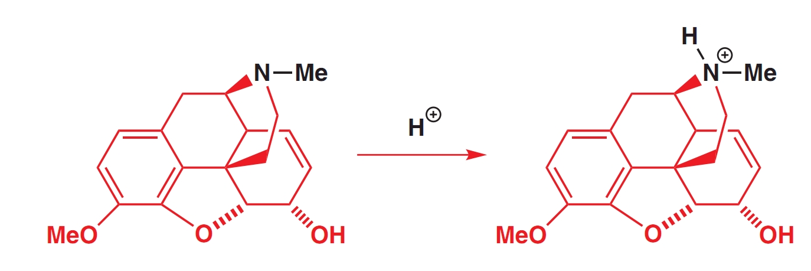

# Löslichkeit von Säuren und Basen

## Keine Reaktion, solange die Säure bzw. Base nicht gelöst vorliegt

Eine Säure bzw. Base kann in einer Lösung erst reagieren, wenn sie gelöst vorliegt. Ein Beispiel: Aspirin (Acetylsalicylsäure) liegt in protonierter Form ungelöst, in deprotonierter Form gelöst vor:

<figure><figcaption>
Aspirin. Links: protonierte Form, rechts: deprotonierte Form
</figcaption></figure>

Aspirin wird als Calcium- oder Natriumsalz verkauft. Im Magen würde es wegen dem tiefen pH-Wert von ca. 1-2 wieder als Feststoff ausfallen. Sobald das Aspirin aber im Dünndarm, der eine basische Umgebung ist, ankommt, löst es sich und kommt zur Wirkung.

Analog verhält es sich mit Basen. Liegen sie protoniert vor, so können sie gelöst werden. Als Beispiel: Codein, ein Schmerzmittel.

<figure><figcaption>
Codein. Links: deprotoniert, rechts: protoniert
</figcaption></figure>

Nur die rechte, protonierte Form ist gut wasserlöslich.&#x20;


Benzoesäure wird oft als Konservierungsmittel (E-Nummer: E-210) in Lebensmitteln verwendet. Dabei ist nur die Säureform effektiv als Bakterizid. Da die meisten Lebensmittel sauer sind, kann Benzoesäure eingesetzt werden.\
.png>)


