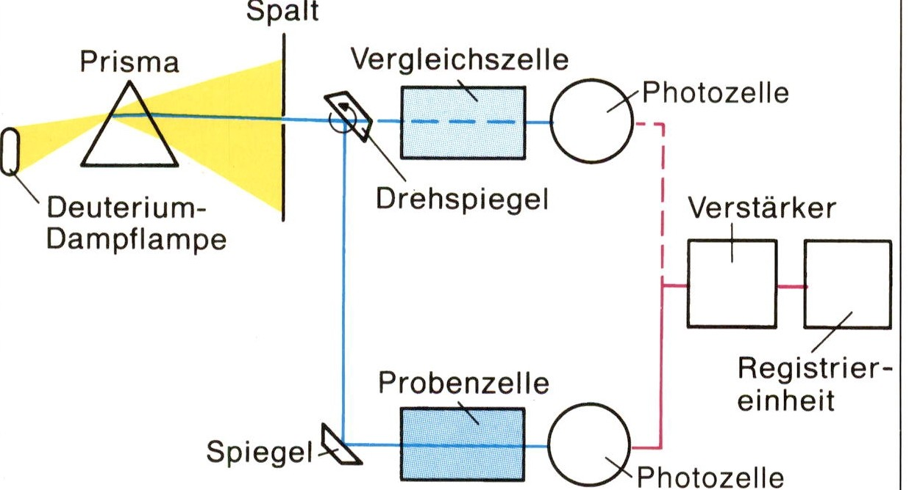

# Infrarotspektroskopie

Zu den wichtigsten Verfahren der instrumentellen Analytik gehören die _spektroskopischen Verfahren._ Diese Methoden beruhen darauf, dass Moleküle elektromagnetische Strahlung absorbieren. Je nach der Energie der Strahlung werden dabei _Elektronen_ auf ein energetisch höheres Niveau angehoben oder es werden _Schwingungen_ und _Rotationen_ von Atomen oder Atomgruppen im Molekül ausgelöst. Mit niedriger Energie kann auch der _Spin_ von Elektronen oder von Atomkernen verändert werden.

Die ältesten spektroskopischen Verfahren beruhen auf der Wechselwirkung von Stoffen mit Licht. Neben dem Absorptionsverhalten im sichtbaren (_visu­_ellen) Bereich des Lichtes (VIS-Spektroskopie) wird häufig auch die Wech­selwirkung der Stoffe mit Ultraviolett-Strahlung (UV-Spektroskopie) oder Infrarot-Strahlung (IR-Spektroskopie) untersucht.

**LAMBERT-BEERsches Gesetz.** Die Wechselwirkung mit elektromagne­tischer Strahlung ist _stoffspezifisch._ Strahlt man beispielsweise Licht der Wellenlänge 590 nm in eine Lösung von Kristallviolett, so wird ein Teil des eingestrahlten Lichtes absorbiert. Im Photometer vergleicht man mit Hilfe einer Photozelle die ursprüngliche Intensität /0 mit der Lichtintensität /, die durch die Probe hindurchtritt. Als Mass für die Absorption verwendet man eine logarithmische Größe, die _**Extinktion** E._ Dabei gilt:

$$E=\lg \frac{I_0}{I}$$

In verdünnter Lösung stellt man fest, dass die Extinktion der Konzentra­tion _c_ des Stoffes und der Schichtdicke _d_ der Probe proportional ist. Diese Beziehung wird als _LAMBERT-BEERsches Gesetz_ bezeichnet:

$$E(\lambda) \sim c \cdot d \Leftrightarrow E(\lambda)=\varepsilon_\lambda \cdot c \cdot d$$

Der Proportionalitätsfaktor $$\mathcal{\varepsilon}_\lambda$$ heißt _molarer Extinktionskoeffizient._ Er ist eine stoffspezifische Größe, die sehr stark von der Wellenlänge $$\lambda$$ abhängt. Über die Extinktion einer Lösung lässt sich die Konzentration des gelösten Stof­fes ermitteln.

Oft interessiert das Absorptionsverhalten in einem größeren Spektral­bereich. Dazu misst man mit einem _Spektralphotometer_ die Extinktion einer Probe bei unterschiedlichen Wellenlängen. Trägt man in einem Diagramm die Extinktion in Abhängigkeit von der Wellenlänge auf, so erhält man das **Absorptionsspektrum** des Stoffes.

<figure><figcaption>
Anregung durch Wechselwirkung mit elektromagnetischer Strahlung
</figcaption></figure>

<figure><figcaption>
Wechselwirkung von Licht und Materie
</figcaption></figure>

Manche organischen Verbindungen sind farbig. Ihre Moleküle absorbieren sichtbares Licht. Durch die Energie der absorbierten Strahlung werden die Moleküle angeregt. Dabei werden die Elektronen auf ein energetisch höhe­ res Niveau angehoben.

Bei der Betrachtung der Molekülstruktur farbiger organischer Verbindungen wie Chlorophyll, Carotin oder Indigo fällt auf, dass diese Moleküle ein aus­ gedehntes System _delokalisierter_ $$\pi$$-Elektronen besitzen. Diese Elektronen sind nicht fest gebunden und können daher leicht angeregt werden. Dazu genügt bereits die Energie des sichtbaren Lichts. Im Gegensatz zu den Absorptionsspektren von Atomen erhält man bei Molekülen keine Linien­spektren, sondern _Bandenspektren,_ weil nicht nur Elektronen, sondern auch Schwingungen und Rotationen des Moleküls angeregt werden.

Die meisten organischen Verbindungen sind farblos. Die Energie des sicht­ baren Lichtes reicht nicht aus, um ihre Elektronen anzuregen. Mit energie­ reicherer UV-Strahlung ist eine Anregung allerdings möglich. Besonders hoch ist die Anregungsenergie für $$\sigma$$_-Elektronen._ So absorbieren gesättigte Kohlenwasserstoffe erst unterhalb einer Wellenlänge von 140 nm. Das UV­ Spektrum von Methan hat zum Beispiel ein Absorptionsmaximum bei 125 nm. _Freie Elektronenpaare_ und _Elektronen_ in _Mehrfachbindungen_ sind leichter anzuregen. Im UV-Spektrum des Acetons beruht das Absorptions­maximum bei 190 nm auf der Anregung der $$\pi$$_-Elektronen_ der C = O-Zwei­fachbindung, die Bande bei 280 nm ist bedingt durch die Anregung der freien Elektronenpaare des Sauerstoff-Atoms.

**Spektralphotometer.** Die wesentlichen Bauteile eines Spektralphotometers sind eine _Strahlungsquelle,_ ein _Prisma_ und eine _Photozelle._ Mit Hilfe des Prismas wird monochromatische Strahlung, also Strahlung einer bestimm­ten Wellenlänge, hergestellt. Die Photozelle dient zur Messung der Licht­ intensität. Die Spektralphotometer sind meistens _Zweistrahlgeräte._ Dabei wird die monochromatische Strahlung in zwei gleichartige Strahlen zerlegt. Der eine Strahl wird durch die Probe geführt, der zweite durch eine _Ver­gleichszelle_ mit dem reinen Lösungsmittel. Mit lichtempfindlichen Halbleitern als Detektoren wird die Intensität der beiden Strahlen gemessen und dann elektronisch verglichen. Die Extinktion kann dann in Abhängigkeit von der Wellenlänge als Zahlenwert angegeben werden. Moderne Geräte drucken das gesamte Absorptionsspektrum auf einem Schreiber aus oder zeigen es auf einem Monitor an.

<figure><figcaption>
Aufbau eines Spektralphotometers
</figcaption></figure>

<figure><figcaption>
Absorptionsspektrum von Chlorophyll
</figcaption></figure>

**Molekülschwingungen.** Infrarot-Strahlung kann in Molekülen Schwingun­gen und Rotationen anregen. Man kann sich die Schwingungen der Atome eines Moleküls anschaulich wie die Schwingungen von Kugeln vorstellen, die über Federn miteinander verbunden sind. In einem Molekül können einerseits _Valenzschwingungen_ auftreten, bei denen die Bindungslängen während des Schwingens periodisch verkürzt und verlängert werden. Dane­ben gibt es _Deformationsschwingungen:_ Das Molekül schwingt unter peri­odischer Verkleinerung und Vergrößerung von Bindungswinkeln. Außer Schwingungen können auch Rotationen angeregt werden.

**Anwendung.** Ein Vergleich zahlreicher IR-Spektren zeigt, dass bestimmte Atomgruppierungen weitgehend unabhängig von benachbarten Atomen immer IR-Strahlung im gleichen Wellenlängenbereich absorbieren. Vor allem funktionelle Gruppen haben häufig charakteristische _Absorptions­banden_ (Schlüsselbanden). Mit Hilfe der IR-Spektroskopie ist es daher möglich, in einem Molekül bestimmte funktionelle Gruppen zu erkennen. Die IR-Spektroskopie ist damit ein wichtiges Hilfsmittel bei der Strukturauf­klärung organischer Verbindungen.

**Strukturaufklärung.** Die Lage einer Absorptionsbande im IR-Spektrum wird von drei Faktoren bestimmt:

1. Die Frequenz der Schwingung und damit auch die zur Anregung der Schwingung notwendige Energie ist umso größer, je stärker die betref­fende Bindung ist. Man kann diesen Zusammenhang im Kugel/Feder­ Modell veranschaulichen: Je stärker die Feder zwischen den beiden Kugeln ist, desto mehr Energie muss zugeführt werden, um die Schwin­gung auszulösen. So schwingt die stärkere C = C-Zweifachbindung mit einer höheren Frequenz als die C-C-Einfachbindung. Die Absorptions­bande der C = C-Zweifachbindung liegt dementsprechend bei höherer Wellenzahl als die Absorptionsbande der C-C-Einfachbindung.
2. Die Frequenz der Schwingung ist bei ähnlicher Bindungsenergie umso größer, je kleiner die Massen der schwingenden Atome sind. Dem ent­spricht die Beobachtung, dass mit derselben Feder leichte Kugeln viel schneller schwingen als schwere Kugeln. Um beispielsweise eine C-H­ Valenzschwingung anzuregen, muss daher viel mehr Energie auf­ gewendet werden als für eine C-CI-Valenzschwingung.
3. Deformationsschwingungen sind leichter anzuregen als Valenzschwin­gungen.

<figure><figcaption>
<em>Valenzschwingung und Deformationsschwingung in Molekülen</em>
</figcaption></figure>

<figure><figcaption>
IR-Spektren von Ethanol und Dimethylether. In IR-Spektren trägt man die Durchlässigkeit D=\frac{1}{I_0}gegen die Wellenzahl \tilde{v}=\frac{1}{\lambda} auf.
</figcaption></figure>

